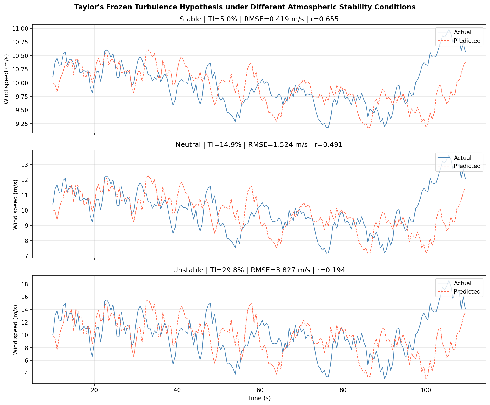
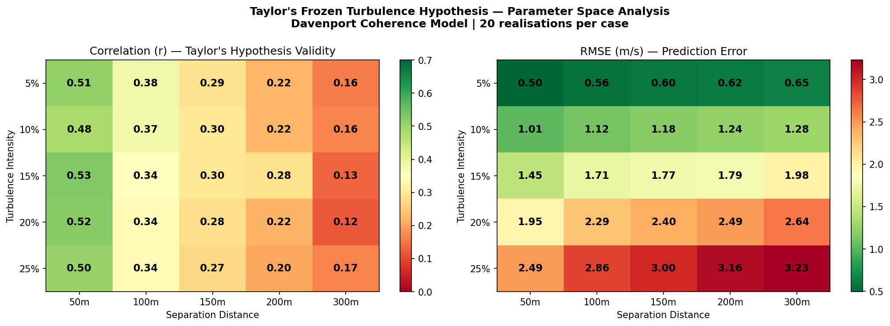
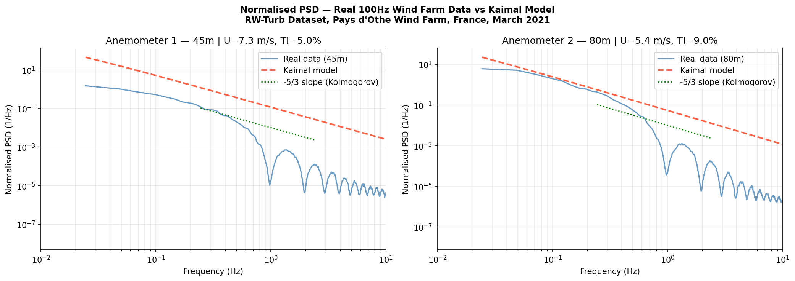
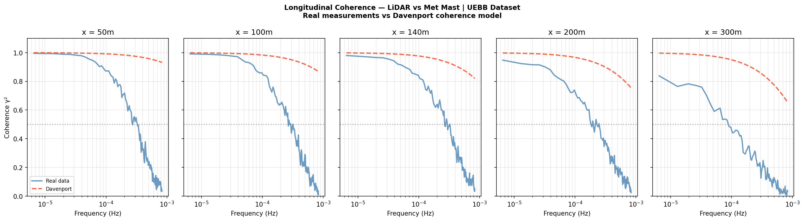

# LiDAR Wind Field Forecasting

Parametric study of Taylor's Frozen Turbulence Hypothesis validity for LiDAR-based wind field forecasting. Investigates how atmospheric stability and measurement distance affect prediction accuracy using synthetic wind generation, Davenport coherence modelling, and validation against real wind farm datasets.

## Research Question

How does prediction error of a Taylor's Frozen Turbulence Hypothesis-based wind forecasting method vary as a function of measurement distance and turbulence intensity, and under which conditions does the hypothesis become unreliable for real-time wind turbine control?

## Background

Wind turbines react to wind only after it reaches the rotor, resulting in increased structural loads and reduced efficiency. Upstream LiDAR measurements enable predictive feedforward control by estimating incoming wind fields ahead of the turbine. The standard approach converts these measurements into rotor-plane forecasts using Taylor's Frozen Turbulence Hypothesis (TFH) — which assumes turbulent structures are advected downstream without evolution.

In practice, coherence between upstream and downstream signals decays in a frequency-dependent way. High-frequency (small-scale) turbulent structures decorrelate rapidly over short distances, while low-frequency structures remain coherent over longer distances. This breakdown is most severe under unstable atmospheric conditions — exactly when loads are highest and prediction matters most.

## Methodology

### 1. Synthetic Wind Generation
Wind time series generated using the Kaimal spectral model (IEC 61400-1 standard). Three stability conditions simulated by varying turbulence intensity:

| Condition | TI | Description |
|-----------|-----|-------------|
| Stable | ~5% | Night-time, stratified flow |
| Neutral | ~15% | Overcast, moderate mixing |
| Unstable | ~30% | Daytime, strong thermal convection |

### 2. Davenport Coherence Model
Downstream signal generated using the Davenport coherence function:

    γ = exp(-decay × f × x / U)

where f is frequency, x is separation distance, and U is mean wind speed. This models the frequency-dependent decorrelation of turbulent structures during advection — the physical process that TFH ignores.

### 3. Parameter Sweep
Full parameter sweep over 5 turbulence intensities × 5 separation distances × 20 realisations per case (500 total simulations). Error metrics: RMSE and Pearson correlation coefficient.

### 4. Real Data Validation
Two real wind farm datasets used for consistency checks:

- **UEBB Dataset** (Beberibe Wind Farm, Brazil) — concurrent LiDAR and met mast measurements used to compute longitudinal coherence at separation distances of 50–300m
- **RW-Turb Dataset** (Pays d'Othe Wind Farm, France) — 100Hz sonic anemometer data at two heights used for power spectral density comparison against the Kaimal model

## Key Results

### Stability Comparison

| Condition | TI (%) | RMSE (m/s) | Correlation (r) | Validity |
|-----------|--------|------------|-----------------|----------|
| Stable | 5.0 | 0.419 | 0.655 | Good |
| Neutral | 14.9 | 1.524 | 0.491 | Moderate |
| Unstable | 29.8 | 3.827 | 0.194 | Poor |

### Parameter Space Analysis

TFH correlation degrades from r=0.51 (50m, 5% TI) to r=0.12 (300m, 20% TI). **Distance effect dominates over turbulence intensity — TFH becomes unreliable beyond 100m separation regardless of TI.**

### Real Data Validation

**Power Spectral Density — 100Hz sonic anemometer vs Kaimal model:**

Real wind farm data confirms the expected -5/3 inertial subrange slope, consistent with the Kaimal spectral model used in the synthetic analysis.

**Longitudinal Coherence — LiDAR vs met mast vs Davenport model:**

Real LiDAR measurements show coherence decaying from ~1.0 at low frequencies to ~0 at high frequencies, consistent with the Davenport model. The Davenport model overestimates coherence at higher frequencies, suggesting the standard decay parameter (8.0) is conservative under real coastal wind farm conditions.

## Setup Parameters

    Mean wind speed:      10.0 m/s
    Measurement height:   80.0 m
    Separation distances: 50, 100, 150, 200, 300 m
    TI values:            5%, 10%, 15%, 20%, 25%
    Signal duration:      600 s
    Time resolution:      0.1 s
    Realisations:         20 per case

## Repository Structure

    lidar-wind-forecasting/
    ├── 01_lidar_wind_forecasting.ipynb  # Main analysis notebook
    ├── data/                            # Downloaded datasets (not tracked)
    ├── results/
    │   ├── stability_comparison.png
    │   ├── correlation_vs_ti.png
    │   ├── power_spectra.png
    │   ├── parameter_sweep_heatmap.png
    │   ├── real_data_100Hz_psd_comparison.png
    │   └── real_data_lidar_coherence.png
    └── README.md

## Datasets

- **UEBB Dataset**: Passos et al. (2017). Coastal operating wind farms: two datasets with concurrent SCADA, LiDAR and turbulent fluxes. Zenodo. https://doi.org/10.5281/zenodo.1475197
- **RW-Turb Dataset**: Gires et al. (2022). Combined high-resolution rainfall and wind data collected for 3 months at a wind farm. Zenodo. https://doi.org/10.5281/zenodo.5801900

## Installation

    git clone https://github.com/qama94/lidar-wind-forecasting.git
    cd lidar-wind-forecasting
    pip install -r requirements.txt
    jupyter notebook

## References

- Kaimal et al. (1972). Spectral characteristics of surface-layer turbulence. QJRMS.
- Taylor, G.I. (1938). The spectrum of turbulence. Proceedings of the Royal Society A.
- Davenport, A.G. (1961). The spectrum of horizontal gustiness near the ground. QJRMS.
- Schlipf et al. (2010). Lidar-assisted feedforward wind turbine control. EWEC.
- IEC 61400-1 (2019). Wind energy generation systems — Design requirements.

## Author

Gamar Ismayilova
[linkedin.com/in/gamar-ismayilova](https://linkedin.com/in/gamar-ismayilova) | gamar.ismayilova@gmail.com